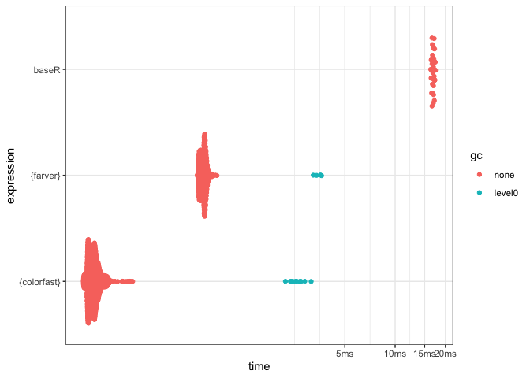
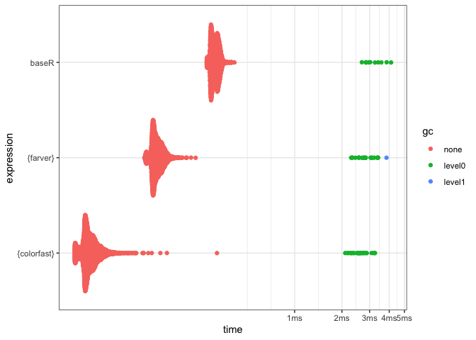
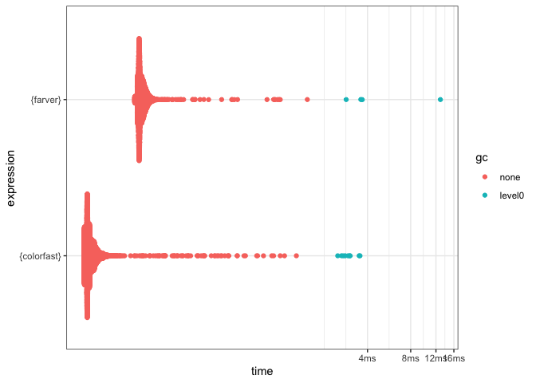

<!-- README.md is generated from README.Rmd. Please edit that file -->

# colourlookup

<!-- badges: start -->


[](https://github.com/coolbutuseless/colourlookup/actions/workflows/R-CMD-check.yaml)
<!-- badges: end -->

`{colourlookup}` is a proof-of-concept technical demonstration of an
order-preserving minimal perfect hash in application to R colour
handling.

Using a hash to match colour names can be of the order of ~100x faster
than a linear search.

### R colours

R has 657 built-in colour names it understands e.g. “red”, “hotpink”.
This is a fixed list of colours that has not changed membership since
originally introduced (as far as I know).

When looking up colours with base R `col2rgb()`, a linear search over
these 657 colours is performed to find the matching RGBA values.

Since the list of colours is fixed and known, this colour lookup can be
replaced by a hash lookup which is faster.

In particular, this package uses an *order-preserving minimal perfect
hash* - see the technical details at the bottom of this page.

### What’s in the box

- `col_to_rgb()` a version of `col2rgb()` which uses hash lookup rather
  than linear search to match R colour names to RGBA values. \####
  Benchmark

### Benchmark

This benchmark compares named colour lookup of RGBA values with:

- baseR’s `col2rgb()` (using linear name search)
- colour lookup using `farver::decode_colour()`
- this package’s `col_to_rgb()` using a hashed name lookup.

<details>
<summary>
Click to show/hide benchmarking code
</summary>

``` r
cols <- sample(colours(), 10000, T)

res <- bench::mark(
  `this package (hash)` = col_to_rgb(cols),
  `farver` = decode_colour(cols),
  `baseR (linear)` = col2rgb(cols, alpha = TRUE),
  check = FALSE
)
knitr::kable(res[,1:5])
```

| expression          |     min |  median |    itr/sec | mem_alloc |
|:--------------------|--------:|--------:|-----------:|----------:|
| this package (hash) | 138.7µs | 149.2µs | 6551.40427 |     166KB |
| farver              | 564.9µs | 576.4µs | 1722.62984 |     172KB |
| baseR (linear)      |  15.9ms |  17.1ms |   58.40246 |     313KB |

</details>


## Installation

You can install from
[GitHub](https://github.com/coolbutuseless/colourlookup) with:

``` r
# install.package('remotes')
remotes::install_github('coolbutuseless/colourlookup')
```

## Example

``` r
library(colourlookup)

col_to_rgb(c("hotpink", "#abc", "#aabb99", "#aabb9980"))
#>       [,1] [,2] [,3] [,4]
#> red    255  170  170  170
#> green  105  187  187  187
#> blue   180  204  153  153
#> alpha  255  255  255  128
```

## Creating the C code for the minimal perfect hash

There are a number of programs which will produce C code to do minimal
perfect hashing of a list of strings e.g. `gperf`, `cmph`.

I chose `mph` as described in [A Family of Perfect Hashing
Methods(pdf)](https://staff.itee.uq.edu.au/havas/TR0242.pdf)

- Download and compile
  \[<http://www.ibiblio.org/pub/Linux/devel/lang/c/mph-1.2.tar.gz>\]
- In R: `writeLines(colors(), "input.txt")`
- On the command line: `mph < input.txt | emitc > hash.c`
- Incorporate the `hash.c` code into this package and add the
  `col_to_rgb()` wrapper which uses it.

# Benchmarks

## Looking up RGBA values for all named colours in R

Example

``` r
col_to_rgb(c('white', 'blue'))
#>       [,1] [,2]
#> red    255    0
#> green  255    0
#> blue   255  255
#> alpha  255  255
```

<details>
<summary>
Click to show/hide benchmarking code
</summary>

``` r
#~~~~~~~~~~~~~~~~~~~~~~~~~~~~~~~~~~~~~~~~~~~~~~~~~~~~~~~~~~~~~~~~~~~~~~~~~~~~
# Lots of named colours
#~~~~~~~~~~~~~~~~~~~~~~~~~~~~~~~~~~~~~~~~~~~~~~~~~~~~~~~~~~~~~~~~~~~~~~~~~~~~
cols <- sample(colours(), 10000, T)

#~~~~~~~~~~~~~~~~~~~~~~~~~~~~~~~~~~~~~~~~~~~~~~~~~~~~~~~~~~~~~~~~~~~~~~~~~~~~
# Check we all agree on the RGB representation
#~~~~~~~~~~~~~~~~~~~~~~~~~~~~~~~~~~~~~~~~~~~~~~~~~~~~~~~~~~~~~~~~~~~~~~~~~~~~
a1 <- col_to_rgb(cols)
a2 <- col2rgb(cols, alpha = TRUE)
a3 <- farver::decode_colour(cols) |> t()
a3 <- rbind(a3, 255L)
rownames(a3) <- c('red', 'green', 'blue', 'alpha')
identical(a1, a2)
#> [1] TRUE
```

``` r
identical(a2, a3)
#> [1] TRUE
```

``` r

#~~~~~~~~~~~~~~~~~~~~~~~~~~~~~~~~~~~~~~~~~~~~~~~~~~~~~~~~~~~~~~~~~~~~~~~~~~~~
# Benchmark
#~~~~~~~~~~~~~~~~~~~~~~~~~~~~~~~~~~~~~~~~~~~~~~~~~~~~~~~~~~~~~~~~~~~~~~~~~~~~
library(farver)
res <- bench::mark(
  colourlookup = col_to_rgb(cols),
  baseR        = col2rgb(cols, alpha = TRUE),
  farver       = decode_colour(cols, alpha = TRUE),
  check = FALSE
)
knitr::kable(res[,1:5])
```

| expression   |     min |  median |    itr/sec | mem_alloc |
|:-------------|--------:|--------:|-----------:|----------:|
| colourlookup | 140.3µs |   162µs | 6138.72204 |     156KB |
| baseR        |  16.6ms |  17.3ms |   57.33833 |     313KB |
| farver       | 567.9µs | 632.2µs | 1592.72642 |     313KB |

</details>



## Looking up RGBA values for hex colours in R

Example

``` r
col_to_rgb(c('#12345678', '#ab1276'))
#>       [,1] [,2]
#> red     18  171
#> green   52   18
#> blue    86  118
#> alpha  120  255
```

<details>
<summary>
Click to show/hide benchmarking code
</summary>

``` r
#~~~~~~~~~~~~~~~~~~~~~~~~~~~~~~~~~~~~~~~~~~~~~~~~~~~~~~~~~~~~~~~~~~~~~~~~~~~~
# Lots of hex colours
#~~~~~~~~~~~~~~~~~~~~~~~~~~~~~~~~~~~~~~~~~~~~~~~~~~~~~~~~~~~~~~~~~~~~~~~~~~~~
cols <- sample(colours(), 10000, T) |>
  col_to_rgb() |>
  t() |>
  rgb(maxColorValue = 255)

#~~~~~~~~~~~~~~~~~~~~~~~~~~~~~~~~~~~~~~~~~~~~~~~~~~~~~~~~~~~~~~~~~~~~~~~~~~~~
# Check we all agree on the RGB representation
#~~~~~~~~~~~~~~~~~~~~~~~~~~~~~~~~~~~~~~~~~~~~~~~~~~~~~~~~~~~~~~~~~~~~~~~~~~~~
a1 <- col_to_rgb(cols)
a2 <- col2rgb(cols, alpha = TRUE)
a3 <- farver::decode_colour(cols) |> t()
a3 <- rbind(a3, 255L)
rownames(a3) <- c('red', 'green', 'blue', 'alpha')
identical(a1, a2)
#> [1] TRUE
```

``` r
identical(a2, a3)
#> [1] TRUE
```

``` r

#~~~~~~~~~~~~~~~~~~~~~~~~~~~~~~~~~~~~~~~~~~~~~~~~~~~~~~~~~~~~~~~~~~~~~~~~~~~~
# benchmark
#~~~~~~~~~~~~~~~~~~~~~~~~~~~~~~~~~~~~~~~~~~~~~~~~~~~~~~~~~~~~~~~~~~~~~~~~~~~~
library(farver)
res <- bench::mark(
  colourlookup = col_to_rgb(cols),
  baseR        = col2rgb(cols, alpha = TRUE),
  farver       = decode_colour(cols, alpha = TRUE),
  check = FALSE
)
knitr::kable(res[,1:5])
```

| expression   |     min |  median |   itr/sec | mem_alloc |
|:-------------|--------:|--------:|----------:|----------:|
| colourlookup |  39.8µs |  49.5µs | 19924.052 |     156KB |
| baseR        | 276.1µs | 318.9µs |  3133.678 |     313KB |
| farver       |  90.9µs | 112.4µs |  8804.762 |     313KB |

</details>



## Looking up native raster “packed integer” for hex colours in R

Example

``` r
col_to_packed_int(c('#12345678', '#ab1276'))
#> [1] 2018915346   -9039189
```

<details>
<summary>
Click to show/hide benchmarking code
</summary>

``` r
#~~~~~~~~~~~~~~~~~~~~~~~~~~~~~~~~~~~~~~~~~~~~~~~~~~~~~~~~~~~~~~~~~~~~~~~~~~~~
# Lots of hex colours
#~~~~~~~~~~~~~~~~~~~~~~~~~~~~~~~~~~~~~~~~~~~~~~~~~~~~~~~~~~~~~~~~~~~~~~~~~~~~
cols <- sample(colours(), 10000, T) |>
  col_to_rgb() |>
  t() |>
  rgb(maxColorValue = 255)


#~~~~~~~~~~~~~~~~~~~~~~~~~~~~~~~~~~~~~~~~~~~~~~~~~~~~~~~~~~~~~~~~~~~~~~~~~~~~
# benchmark
#~~~~~~~~~~~~~~~~~~~~~~~~~~~~~~~~~~~~~~~~~~~~~~~~~~~~~~~~~~~~~~~~~~~~~~~~~~~~
library(farver)
res <- bench::mark(
  `this package` = col_to_packed_int(cols),
  farver         = encode_native(cols),
  check = FALSE
)

knitr::kable(res[,1:5])
```

| expression   |    min | median |  itr/sec | mem_alloc |
|:-------------|-------:|-------:|---------:|----------:|
| this package | 43.8µs | 47.4µs | 20751.52 |    39.1KB |
| farver       | 77.4µs | 84.9µs | 11652.11 |    45.6KB |

</details>



# Technical Details: Order-preserving minimal perfect hash

### Hash

A **hash** of a string is just a combination of the bits in the string
to produce another value.

Useful hashes are those that produce markedly different output for
slightly different inputs. e.g. CRC32, SHA1, MD5

The `hash()` function in `{rlang}` is a good example of such a hash.
Note how different the output of the hash is when only one character has
changed.

``` r
rlang::hash("hello")
#> [1] "48b69f4c216ac6e6dd32d65a6c53451e"
```

``` r
rlang::hash("hello!")
#> [1] "e3e018855766ef8629be247a8f3cc443"
```

### Hash collisions

Due to the limits of reality, hashing arbitrary length strings into
shorter strings will mean that for some special cases different strings
will produce the same hashed output (see [the pigeonhole
principle](https://en.wikipedia.org/wiki/Pigeonhole_principle)). This is
known as a [hash
collision](https://en.wikipedia.org/wiki/Hash_collision)

Hash collisions mean that you don’t know for sure which string produced
a particular hash, and so extra context information is kept to help
disambiguate when this occurs.

    hash("apple")  => 1034  # Collision with "carrot"
    hash("banana") => 245
    hash("carrot") => 1034  # Collision with "apple"

### Perfect Hashing

[Perfect hashing](https://en.wikipedia.org/wiki/Perfect_hash_function)
is when the input data is known and fixed, and there exists a hash that
has no collisions.

    hash("apple")  => 1034 
    hash("banana") => 245
    hash("carrot") => 876  

### Minimal Perfect Hashing

[Minimal Perfect
Hashing](https://en.wikipedia.org/wiki/Perfect_hash_function#Minimal_perfect_hash_function)
is when a perfect hash can map *n* strings onto *n* consecutive
integers.

Note: the order of the integers does not have to match the original
order of the strings.

    hash("apple")  => 3 
    hash("banana") => 1
    hash("carrot") => 2  

### Order-Preserving Minimal Perfect Hashing

[Order-Preserving minimal perfect
hashing](https://en.wikipedia.org/wiki/Perfect_hash_function#Order_preservation)
is when the *n* strings match to *n* consecutive integers in the same
order as the strings were defined.

As an example, if we have 3 strings “apple”, “banana” and “carrot”, an
*order-preserving minimal perfect hash* would have the following result:

    hash("apple")  => 1
    hash("banana") => 2
    hash("carrot") => 3
